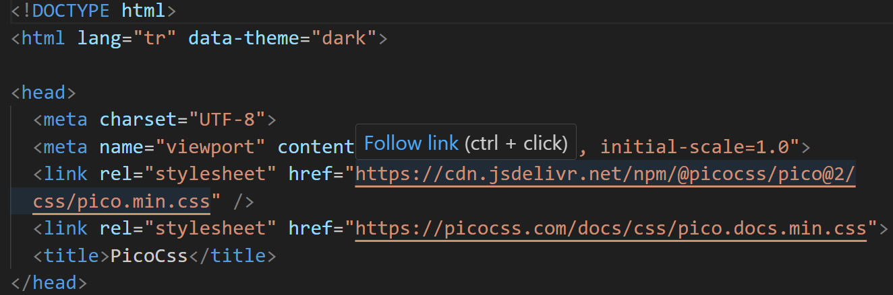

# Pico Css

Bu projede pico css kullanarak sadece HTML etiketlerini kullanarak bir site yaptım. 

Pico css bize sadece HTML bilgisi ile bir kaç dakika içinde basit sayfaları ve siteleri nasıl yapabileceğimizi gösteriyor.

Pico css kullanmak için HTML sayfalarının `<head><head>` etiketlerinin arasına `<link rel="stylesheet" href="https://cdn.jsdelivr.net/npm/@picocss/pico@1/css/pico.min.css">` bu kodu eklemeniz yeterli olacaktır.

Projenin Canlı Hali: [Buradan Ulaşabilirsiniz](https://tugba-pico-css-demo.netlify.app) 

 Pico Css Web Sitesi: [Buradan Ulaşabilirsiniz](https://picocss.com/) 

